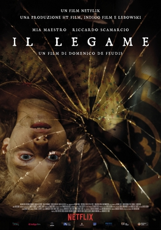

#The Binding (El vínculo)

The Binding (Italian: Il legame) is a 2020 Italian film directed by Domenico Emanuele de Feudis, written by Daniele Cosci, Davide Orsini and Domenico Emanuele de Feudis and starring Riccardo Scamarcio, Michael C. Pizzuto and Federica Rosellini.[1][2] While visiting her fiancé's mother in southern Italy, a woman must fight off a mysterious and malevolent curse intent on claiming her young daughter.

Cast
Riccardo Scamarcio
Mía Maestro
Michael C. Pizzuto
Federica Rosellini
Sebastiano Filocamo as Don Gino
References
 "The Binding (2020) review – dullness murks the relationships between characters". Ready Steady Cut. October 2, 2020.
 "The Binding – Netflix Review (3/5)". Heaven of Horror. October 2, 2020.
External links
The Binding at IMDb
The Binding on Netflix Edit this at Wikidata

#Criticas

- Puede sonar a tópico. Pero una de las cosas que siempre me ha fascinado, es que, independientemente del resultado final del producto, los cineastas italianos siempre consiguen capturar toda la belleza que pueden en alguno o algunos de los elementos de las cintas que sacan.
***
- Sobre pasar la trama por un filtro de costumbrismo que se agradece, Lazos Malditos no consigue ofrecer un solo elemento lo más mínimamente original o sorprendente, con una historia sobrenatural que recuerda a mil películas mejores. En las actuaciones no encontramos mucho a destacar, con un Riccardo Scamarcio con el piloto automático, y la niña poseída interpretada de forma más que correcta por Giula Patrignani que resulta de lo más convincente de todo el film.
***
- Domenico De Feudos se atreve con el terror Netflix y demuestra cuáles son sus referentes, bien alejado de las etapas del terror italiano, en una más qué interesante película de baja producción y altísimo rendimiento
