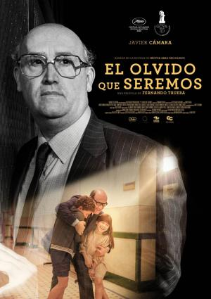

#El olvido que seremos

Narra de manera íntima la historia de un hombre bueno, el médico colombiano Héctor Abad Gómez, carismático líder social y hombre de familia, un destacado médico y activista por los derechos humanos en el Medellín polarizado y violento de los años 70. La trama relata la vida del doctor y padre de familia, preocupado tanto por sus hijos como por los niños de clases menos favorecidas. En su casa se respiraba la vitalidad y la creatividad características de una educación fundamentada en la tolerancia y el amor, pero la violencia ambiental del país condicionaba la vida de todo su entorno.

#Criticas

- Un planteamiento antiguo, alejado de los tiempos, volcando emociones que ya no llegan, aunque se tiñan de aparente autenticidad.Ambientación e interpretaciones brillantes. Lo que falla es la manera en que se narra la historia, buscando ese efectismo emocional que finalmente, a mi entender, no se traduce en algo auténtico.
***
- La última película de Fernando Trueba sigue la novela de Héctor Abad Faciolince, de título homónimo. El film es básicamente un tratado sobre el recuerdo construido desde las emociones, una memoria sentimental cargada de añoranza y afectos. Una semblanza sobre el Dr. Abad, el padre del novelista, el médico activista social y político en el Medellín de los años setenta y asesinado por sicarios en 1987.
***
- El olvido que seremos nos acerca a la figura de Héctor Abad Gómez, médico de profesión y líder social colombiano. Desde un punto de vista variable, Fernando Trueba narra la historia de un buen hombre que luchó por los derechos de los más desfavorecidos, sin ideologías extremistas en una época en la que Medellín estaba polarizada. La cinta nos muestra la vida de una persona que no se rige bajo el código de actuación dominante, sino que su amor y valores humanos, están por encima de sus actos.

