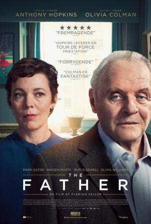

#El pare (The Father)

Anthony (Anthony Hopkins), un hombre de 80 años mordaz, algo travieso y que tercamente ha decidido vivir solo, rechaza todos y cada uno de las cuidadoras que su hija Anne (Olivia Colman) intenta contratar para que le ayuden en casa. Está desesperada porque ya no puede visitarle a diario y siente que la mente de su padre empieza a fallar y se desconecta cada vez más de la realidad. Anne sufre la paulatina pérdida de su padre a medida que la mente de éste se deteriora, pero también se aferra al derecho a vivir su propia vida.

#Criticas

- "The Father" es la adaptación cinematográfica de la obra de teatro homónima del dramaturgo francés Florian Zeller, una de las obras más celebradas de la pasada década, representada en múltiples países (aquí en España con Hector Alterio en el papel principal) y adaptada ahora al cine por el propio autor, que firma el guión en colaboración con Christopher Hampton.
***
- Excelente film que tiene como mejor aval el narrar una historia de demencia senil desde el punto de vista del enfermo, algo que no es demasiado habitual en el cine.
Y Florian Zeller lo hace de forma magistral, clara y precisa, gracias a un soberbio guión a cargo de él y de Christopher Hampton.
***
- Cuando fui a ver 'El padre' al cine me esperaba ver una película enfocada en la tercera edad, pero no creía que fuera a angustiarme tanto desde los primeros minutos. Siempre nos cuesta empatizar con los ancianos cuando están enfermos porque no entendemos lo que es la demencia
