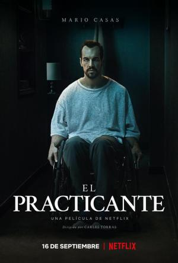

#El practicante

Ángel (Mario Casas) trabaja como técnico en emergencias sanitarias a bordo de una ambulancia. Tras sufrir un grave accidente, su vida junto a Vane (Déborah François) empieza a desmoronarse. Obsesionado con la idea de que ella le es infiel, convertirá su vida en un infierno del que será difícil escapar.

#Criticas

- El mundillo de las ambulancias, donde se tiene que ver de todo, siempre es un buen filón. Ahí está “Al límite”, con Nicolas Cage, por ejemplo.
Pero esta película, aunque al principio parece que va de ese palo, en realidad trata de la deriva psicológica de este practicante, pero tampoco por su trabajo, sino por un accidente y ciertos problemas de pareja.
***
- Netflix ha estrenado otro thriller español, y después de la experiencia que tuve con la muy decepcionante Hogar (también con Mario Casas), no las tenía todas conmigo. Sin embargo, he dejado los prejuicios a un lado y he decidido aventurarme en este thriller de apenas hora y media, con la promesa de ver a Mario Casas en un registro diferente (las recientes comparaciones que se le han hecho con el infinitamente superior Christian Bale, mejor las dejamos a un lado…).
***
- La película tiene un argumento de film de serie b de las tres de la tarde de antena 3. Es previsible y aunque las actuaciones están bien no es nada original y se hace aburrida.
